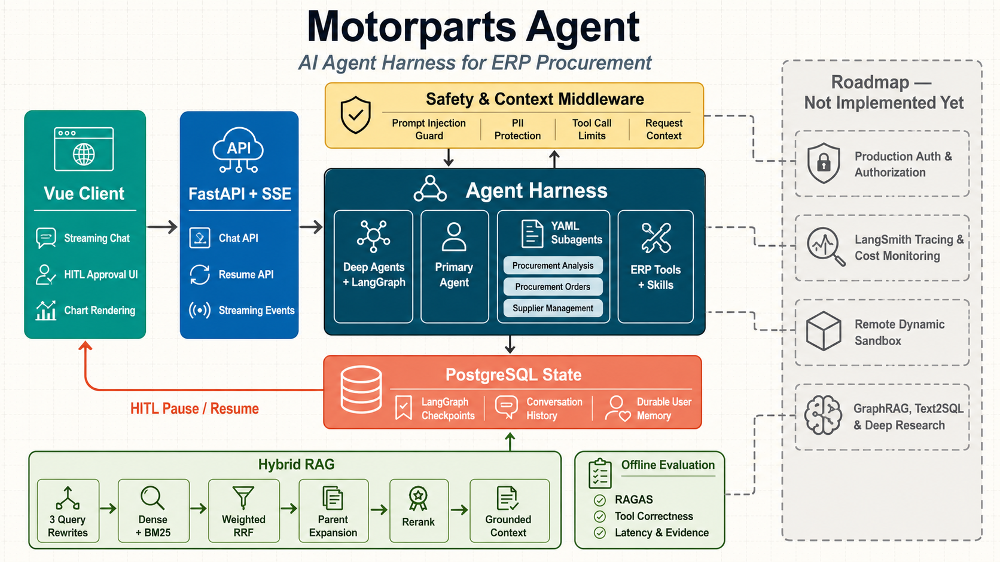

# Motorparts Agent

<p align="center">
  <strong>面向汽车零部件 ERP 采购工作流的 AI Agent Harness</strong><br />
  可靠工具调用、上下文检索、人工审批与可恢复执行。
</p>

<p align="center">
  <a href="README.md">English</a> · <a href="README.zh-CN.md">简体中文</a> ·
  <a href="LICENSE">MIT License</a>
</p>

Motorparts Agent 是一个开源工程项目，将 Harness Engineering 思路应用于具体的采购领域。项目组合了 Deep Agents 与 LangGraph 运行时、ERP 工具、专项子代理、PostgreSQL 状态、混合 RAG、安全中间件和评测运行器。

项目有意聚焦于 LLM 周围的运行时工程：Agent 如何获得可信上下文、使用受限工具、在关键决策前暂停，并从持久化状态继续执行。

> **项目状态：** 持续演进中。认证、可观测性、部署编排及若干高级工作流仍在路线图中。

## 特性

### UI 与流式交互

- **会话工作区**：Vue 3、Pinia、Ant Design Vue/X 和 ECharts 提供流式聊天、持久化会话历史、Markdown 渲染、工具调用时间线、子代理路由可见性和图表输出。
- **SSE 事件契约**：FastAPI 流式传输回答片段、工具开始和结果、路由事件、中断、完成和安全错误事件；客户端将每种事件映射为明确 UI 状态。
- **Human-in-the-Loop 界面**：输入型中断用于补充业务字段；审批型中断为关键操作提供批准/拒绝控件。两种方式都会恢复原线程，而不是开启新的会话轮次。
- **受控图表输出**：采购分析 Agent 仅输出受 schema 校验的单行 chart JSON；服务端拒绝任意 HTML、图片和 ECharts option，前端据此确定性渲染受支持的图表类型。详见 [`Chart-Output-Practical.md`](backend/docs/chart-render/Chart-Output-Practical.md)。

### Agent 运行时与编排

- **基于 LangGraph 的 Deep Agents**：采购主 Agent 集成 checkpoint、长期存储、文件系统工具、Skills、中间件和子代理委派。
- **声明式子代理**：采购分析、采购订单和供应商管理代理均由经过校验的 YAML 定义加载。每份定义独立拥有提示词、工具白名单、附加 Skills 和 HITL 规则。
- **规划与任务控制**：Deep Agents Harness 为多步骤计划提供 `write_todos`，并内置 `read_file`、`write_file`、`edit_file`、目录列举、搜索和 glob 等文件系统操作。
- **可恢复执行**：LangGraph 中断保留精确的 checkpoint 命名空间和前端契约。恢复请求可接受自由文本工具输入或结构化审批决定。
- **写操作人工审批**：供应商与采购订单的创建、更新在 ERP HTTP 请求前由 `interrupt_on` 暂停，只有批准才会提交，拒绝会明确保留未写入状态。详见 [`HITL-Approval-Practical.md`](backend/docs/hitl/HITL-Approval-Practical.md)。

### 上下文工程与记忆

- **请求级上下文编排**：每次运行注入用户标识、用户名、时间和检索上下文。检索文档被明确界定为不可信参考材料，并保留来源 ID。
- **自动上下文窗口管理**：模型暴露 `max_input_tokens` 时，Deep Agents 会自动摘要长对话；默认在上下文窗口的 85% 触发并保留 10%。不提供模型 profile 时，运行时使用更保守的固定 token 回退策略。详见 [`Memory-Practical.md`](backend/docs/memory/Memory-Practical.md)。
- **可恢复的会话压缩**：自动摘要前，被逐出的历史会落入已配置后端，摘要保留路径，Agent 可通过 `read_file` 再次读取。详见 [`Memory-Practical.md`](backend/docs/memory/Memory-Practical.md)。
- **长期用户记忆**：长期记忆按 agent 和用户在 PostgreSQL 中隔离，因此偏好可跨该用户线程保留而不会跨用户泄露。内置操作指南独立存在且只读。详见 [`Memory-Practical.md`](backend/docs/memory/Memory-Practical.md)。
- **分层文件权限**：共享 `/memory/` 指导与 `/skills/` 禁止改写，用户的 `/memories/` 长期记忆可读写；权限约束只覆盖内置文件工具，与执行沙箱独立治理。详见 [`Filesystem-Permission-Practical.md`](backend/docs/memory/Filesystem-Permission-Practical.md)。
- **可迁移的执行沙箱边界**：采购分析的 `execute` 当前用于内部数据聚合、受控图表和报告产出；架构预留 AIO Sandbox 以隔离进程、网络、资源与临时文件。详见 [`Sandbox-Practical.md`](backend/docs/memory/Sandbox-Practical.md)。

### 工具、文件与 Skills

- **受边界限制的 ERP 工具**：类型化注册工具通过共享 HTTP 客户端处理供应商、物料、订单、库存、物流、客户、BI 和知识检索。系统提示词要求 ERP 事实必须来自这些工具。
- **大结果落盘**：Deep Agents 文件系统中间件会将超大的工具结果逐出到文件，并返回精简引用；Agent 可通过带 offset 的 `read_file` 分段读取完整结果。
- **结构化报告交付**：采购分析 Skill 会在可视化前读取图表契约，并将复杂报告写入文件，向父 Agent 返回简洁摘要和文件路径供其回读。
- **渐进式披露 Skills**：版本化 `SKILL.md` 指令挂载于 `/skills/`；静态 Skills 和策略指南禁止写入，`/memories/` 下的用户记忆允许写入。
- **流程化 Skill 架构**：Memory 固化全局规则，Skill 按需加载领域步骤与契约，Tools 执行原子操作，RAG 补充文档知识，避免将所有流程常驻在主提示词中。详见 [`Skill-Architecture-Practical.md`](backend/docs/skills/Skill-Architecture-Practical.md)。

### 混合 RAG 与上下文质量

- **三个角度的查询改写**：在原始查询之外增加语义、关键词和意图三种改写，在混合检索前提升候选命中率与召回率。详见 [`Query-Rewrite-Practical.md`](backend/docs/rag/Query-Rewrite-Practical.md)。
- **混合排序流水线**：向量和 BM25 通道经过加权倒数排名融合、父文档扩展，并可选用 FlagEmbedding 重排后再注入上下文。
- **有依据的上下文边界**：入选片段被标记为不可信、携带来源标识，并与系统指令隔离，降低检索诱导的提示词注入风险。

### Guardrails、状态与可观测性

- **运行时中间件**：主 Agent 已注册提示词注入检测、邮箱/手机号/身份证/银行卡/API Key 的 PII 脱敏或掩码、请求上下文注入，以及单线程/单次运行工具调用上限。
- **RAG 防护与上下文链路**：原始问题与三视角改写经 Dense、BM25、加权 RRF 和重排产生检索上下文；中间件将其标记为不可信参考内容，并在模型与工具调用前实施注入、PII 与调用次数防护。详见 [`RAG-Agent-Middleware-Defense-and-Context.md`](backend/docs/middleware/RAG-Agent-Middleware-Defense-and-Context.md)。
- **状态与可审查基础**：PostgreSQL 持久化 LangGraph checkpoint、会话元数据和用户可见的工具/消息时间线，支持中断恢复和运行后检查。
- **具备追踪调试条件**：SSE 事件保留 LangGraph 节点、步骤、命名空间、子代理和 checkpoint 元数据，开发时可选输出原始调试负载。LangSmith 追踪和生产监控仍属于 Roadmap，而非已完成的可观测性基础设施。

### 评测

- **离线 Agent 评测**：带标签的 ERP Agent 数据集通过 Mock ERP fixture 驱动生产图，记录最终回答、工具选择、检索上下文、工具证据、错误和延迟。
- **RAGAS 质量指标**：可选 LLM Judge 评分忠实度、回答相关性、上下文精确率、上下文召回率和回答正确性；工具正确性则根据预期与实际工具独立计算。
- **可诊断回归评测**：评测复用生产 Agent 编排与只读 ERP fixture，同时保留回答、检索证据、工具轨迹、错误和延迟，帮助区分召回、工具选择与生成问题。详见 [`Ragas-Agent-Evaluation-Practical.md`](backend/docs/evals/Ragas-Agent-Evaluation-Practical.md)。

## 系统架构



架构图将当前运行时与规划中的平台能力分开。当前路径覆盖 Vue 客户端、FastAPI/SSE 边界、LangGraph Agent Harness、工具与 Skills、HITL 暂停/恢复、PostgreSQL 状态、混合 RAG 和离线评测。

## 核心工作流

### 采购分析

主 Agent 接收采购问题，按需委派专项工作，检索 ERP 或知识库证据，并流式返回有依据的回答。结构化图表数据可由前端渲染。

### 信息收集与审批

订单或供应商子代理会请求缺失字段，或准备一个变更操作。LangGraph 在发送 ERP 请求前暂停，界面收集信息或决定后，同一线程从 PostgreSQL checkpoint 恢复。

### 检索增强协助

请求从多个视角改写。向量和稀疏结果经加权 RRF 融合、扩展至父文档、可选重排后，连同来源标识一起进入模型上下文。

## 技术栈

| 层 | 技术 |
| --- | --- |
| Agent 运行时 | Python 3.12、Deep Agents、LangGraph、LangChain |
| API 与传输 | FastAPI、SSE Starlette、HTTPX |
| 状态与记忆 | PostgreSQL、Psycopg、LangGraph PostgreSQL checkpoint/store |
| 检索 | Milvus/Zilliz、向量检索、BM25、RRF、FlagEmbedding 重排 |
| 评测 | RAGAS、pytest、离线 trace 运行器 |
| 客户端 | Vue 3、TypeScript、Vite、Pinia、Ant Design Vue/X、ECharts |

## 快速开始

### 前置要求

- Python 3.12 或更高版本，以及 [uv](https://docs.astral.sh/uv/)
- Node.js 和 [pnpm](https://pnpm.io/)
- PostgreSQL
- OpenAI 兼容的模型端点与 API Key

### 启动后端

```powershell
cd backend
Copy-Item .env.example .env
# 在 .env 中配置 DATABASE_URL 和 MOTORPARTS_MODEL_API_KEY。
uv sync
uv run uvicorn src.api_view.web_main:app --reload --port 8000
```

后端将运行在 `http://localhost:8000`。混合 RAG 为可选能力；配置 Milvus/Zilliz 连接参数后启用。

### 启动前端

```powershell
cd frontend
pnpm install
pnpm dev
```

打开 `http://localhost:5173`。开发期间，Vite 会将 API 请求代理至端口 8000 的后端。

## 截图

后续将在此添加流式聊天、检索增强分析、图表输出和 HITL 审批流程截图。

## 文档索引

### 实践文档

- [`backend/ARCH.md`](backend/ARCH.md)  后端架构说明。
- [`backend/docs/chart-render/Chart-Output-Practical.md`](backend/docs/chart-render/Chart-Output-Practical.md)  受控图表数据契约与前端渲染边界。
- [`backend/docs/evals/Ragas-Agent-Evaluation-Practical.md`](backend/docs/evals/Ragas-Agent-Evaluation-Practical.md)  RAGAS 指标、工具正确性与回归诊断。
- [`backend/docs/hitl/HITL-Approval-Practical.md`](backend/docs/hitl/HITL-Approval-Practical.md)  ERP 写操作的中断、审批与恢复链路。
- [`backend/docs/memory/Filesystem-Permission-Practical.md`](backend/docs/memory/Filesystem-Permission-Practical.md)  Deep Agents 内置文件工具的权限边界。
- [`backend/docs/memory/Memory-Practical.md`](backend/docs/memory/Memory-Practical.md)  会话摘要、长期用户记忆与隔离策略。
- [`backend/docs/memory/Sandbox-Practical.md`](backend/docs/memory/Sandbox-Practical.md)  `execute` 执行隔离与 AIO Sandbox 迁移设计。
- [`backend/docs/middleware/RAG-Agent-Middleware-Defense-and-Context.md`](backend/docs/middleware/RAG-Agent-Middleware-Defense-and-Context.md)  查询、上下文注入、提示注入与 PII 防护链路。
- [`backend/docs/rag/Query-Rewrite-Practical.md`](backend/docs/rag/Query-Rewrite-Practical.md)  四视角查询改写与混合检索实践。
- [`backend/docs/skills/Skill-Architecture-Practical.md`](backend/docs/skills/Skill-Architecture-Practical.md)  Memory、Skill、Tools 与 RAG 的职责分层。

## 路线图

- 生产级认证和授权。
- LangSmith 链路追踪、运行监控和成本可见性。
- 容器化部署与环境编排。
- **AIO Sandbox 迁移**：将采购分析的 `local_shell` 执行后端迁移到 [agent-infra/sandbox](https://github.com/agent-infra/sandbox)，提供隔离的进程、网络、依赖、资源和临时文件边界。
- 更完善的空回答、限流、重试和降级处理。
- 成本感知的评测报告与更完整的回归覆盖。
- GraphRAG 集成，以及通过 LangSmith 或 Langfuse 进行提示词版本管理。
- Text2SQL、深度研究、知识库后台管理和可见推理/规划工作流。

## 许可证

本项目采用 [MIT License](LICENSE) 开源。
